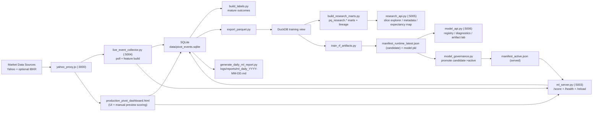

# PivotQuant System

## Purpose
This document is the single operational reference for the live PivotQuant stack and the new institutional research layer:
- data flow
- retrain cadence
- model reload behavior
- daily reporting
- health states and kill-switch guidance
- research marts and research API lineage

## Architecture

```mermaid
flowchart LR
    A["Market Data Sources<br/>Yahoo + optional IBKR"] --> B["yahoo_proxy.js (:3000)"]
    B --> C["live_event_collector.py (:5004)<br/>poll + feature build"]
    B --> D["production_pivot_dashboard.html<br/>(UI + manual preview scoring)"]
    C --> E["SQLite<br/>data/pivot_events.sqlite"]
    D --> E
    E --> F["build_labels.py<br/>mature outcomes"]
    E --> G["export_parquet.py"]
    G --> H["DuckDB training view"]
    H --> H2["build_research_marts.py<br/>pq_research.* marts + lineage"]
    H2 --> H3["research_api.py (:5005)<br/>slice explorer / metadata / expectancy map"]
    H --> I["train_rf_artifacts.py"]
    I --> J["manifest_runtime_latest.json (candidate) + model pkl"]
    J --> J4["model_api.py (:5006)<br/>registry / diagnostics / artifact lab"]
    J --> J2["model_governance.py<br/>promote candidate->active"]
    J2 --> J3["manifest_active.json (served)"]
    J3 --> K["ml_server.py (:5003)<br/>/score + /health + /reload"]
    C --> K
    D --> K
    K --> E
    E --> L["generate_daily_ml_report.py<br/>logs/reports/ml_daily_YYYY-MM-DD.md"]
```

## Core Services
- Dashboard/API proxy: `server/yahoo_proxy.js` on `:3000`
- Event writer: `server/event_writer.py` on `:5002`
- Live collector: `server/live_event_collector.py` on `:5004`
- ML server: `server/ml_server.py` on `:5003`
- Research API: `server/research_api.py` on `:5005`
- Model API: `server/model_api.py` on `:5006`
- Optional IBKR bridge: `server/ibkr_gamma_bridge.py` on `:5001`

## Dashboard Runtime Ownership
- `production_pivot_dashboard.html` is now primarily the dashboard shell:
  - layout and markup
  - DOM anchors
  - workspace bootstrap and wiring
  - the shared browser `state` object
  - shared `fetchJson` / `postJson` helpers and related request/error plumbing
- Extracted dashboard workspace modules now own their domain runtime:
  - `app/research/index.js`
  - `app/models/index.js`
  - `app/governance/index.js`
  - `app/replay/index.js`
  - `app/ops/index.js`
- The shell still intentionally owns the remaining non-workspace runtime:
  - chart runtime
  - market / intraday / live-scoring runtime
  - ML panel and ML runtime helpers
  - shared state
  - shared fetch/post helpers
- Boot-order note:
  - the shell creates late-bound wrapper bridges for Replay and Ops before those workspaces are instantiated
  - wrappers such as `openResearchReplayDate`, `loadReplayDay`, and `loadOpsStatus` are intentionally defined first and then filled by the Replay/Ops workspace factories during bootstrap
  - keep that bootstrap order explicit when editing the dashboard so cross-workspace handoffs do not race uninitialized callbacks

## Runtime Entry Points
- Foreground stack: `bash server/run_all.sh`
- Persistent 24/7 stack (with caffeinate): `bash server/run_persistent_stack.sh`
- Retrain cycle: `bash scripts/run_retrain_cycle.sh`
- Research marts refresh: `python3 scripts/build_research_marts.py`
- Model Lab API: `bash server/run_model_api.sh`
- Primary local validation: `bash scripts/validate_local.sh`
- NPM alias for primary local validation: `npm run validate:local`
- Legacy JS/library validation only: `npm run validate:js`
- Lightweight browser smoke: `npm run test:ui` (runs `scripts/run_ui_smoke.sh`)
- Local Sprint C route/module smoke: `bash scripts/smoke_sprint_c_routes.sh [base_url]`
- Retrain LaunchAgent install: `bash scripts/install_retrain_launch_agent.sh`
- Daily report LaunchAgent install: `bash scripts/install_daily_report_launch_agent.sh [close|morning|both]`
- Ops resilience LaunchAgents install: `bash scripts/install_ops_resilience_launch_agents.sh`
- Air -> Mini research sync export: `python3 scripts/export_research_sync_bundle.py`
- Mini import of Air research bundle: `python3 scripts/import_research_sync_bundle.py --bundle-dir /path/to/bundle`

## Runtime Contract
- Python interpreter resolution for `run_all.sh`, `run_model_api.sh`, and `run_research_api.sh` is explicit:
  - first `PYTHON_BIN` if set and executable
  - then `${ROOT_DIR}/.venv313/bin/python` or `${ROOT_DIR}/.venv313/bin/python3`
  - then `${ROOT_DIR}/.venv/bin/python` or `${ROOT_DIR}/.venv/bin/python3`
  - there is no fallback to an arbitrary system `python3`
- If no supported interpreter is available, startup fails clearly instead of silently drifting to a different runtime.
- `run_all.sh` now exposes explicit research/model service state at startup:
  - `ready`
  - `disabled`
  - `degraded`
  - `failed`
- If `RESEARCH_API_ENABLED=1` or `MODEL_API_ENABLED=1`, startup now reports whether the stack is `ready`, `degraded`, or `failed` instead of implying full readiness when an enabled service is unavailable.
- Enabled `research_api` and `model_api` are only reported as `ready` after both:
  - binding their configured ports
  - passing their direct health checks on `:5005/health` and `:5006/health`
- If either service binds but fails its health endpoint during startup, `run_all.sh` reports that service as `degraded` instead of `ready`.

## Local Validation Contract
- The honest primary local validation path is now `bash scripts/validate_local.sh` or `npm run validate:local`.
- `validate_local.sh` checks the current trust surface in this order:
  - shell syntax for the key runtime scripts
  - research mart build tests
  - research API tests (including endpoint-level contract assertions for `/health`, `/metadata`, `/slice-query`, `/walkforward`, `/replay-day`)
  - model API tests (including endpoint-level contract assertions for `/health`, `/registry`, `/baseline-compare`, `/decision`, `/review-log`, `/governance-summary`, `/governance-workspace`)
  - model-context backfill tests
  - Sprint C route/module smoke against a running local dashboard/proxy
- Route/module smoke expects the dashboard/proxy to already be reachable.
  - Default base URL: `http://127.0.0.1:3000`
  - Override with `VALIDATE_BASE_URL=http://host:port`
- UI smoke expects:
  - dashboard/proxy reachable at `UI_SMOKE_BASE_URL` (default `http://127.0.0.1:3000`)
  - local Playwright dependency installed (`@playwright/test`)
  - Chromium installed via `npx playwright install chromium`
- The old Jest-centered validation surface is still available as `npm run validate:js`, but it is no longer the repo's primary local source of truth.

## Integrity Verification
- Integrity verification is a trust-layer check, not a behavior test suite.
- Run it locally with:
  - `python scripts/verify_release_integrity.py`
  - or `npm run verify:integrity`
- `npm run verify:integrity` and `npm run release:check` both resolve Python using the same runtime contract (`PYTHON_BIN` -> `.venv313` -> `.venv` -> `python3`) so integrity outcomes are deterministic across operator entry points.
- It performs read-only consistency checks across:
  - research lineage/mart integrity (required lineage fields, mart presence, and core schema sanity)
  - model registry integrity (metadata/manifest readability and required registry-entry fields)
  - governance review-store integrity (required review fields plus hash-chain verification when available)
- Output is structured and explicit:
  - `[PASS] ...`, `[WARN] ...`, `[FAIL] ...`
  - final result line: `[RESULT] PASS|WARN|FAIL`
- Exit code contract:
  - `0` on `PASS` or `WARN`
  - `1` on `FAIL`

### Integrity Signal Semantics
- `PASS`:
  - Integrity checks succeeded with no actionable findings.
- `SKIP`:
  - Optional capability check intentionally not available (for example optional schema-level validation tooling).
  - `SKIP` does not downgrade release readiness by itself.
- `WARN`:
  - Integrity is trusted, but action is recommended soon (for example governance review coverage gaps).
- `FAIL`:
  - Integrity trust is broken and must be fixed before treating the system as release-ready.
  - Example: non-empty governance review store/log where hash-chain verification cannot run.
- Burn-in interpretation:
  - Treat repeated `WARN` as a tracked operational issue.
  - Treat any `FAIL` as a stop-and-fix event for that burn-in day.

## Release Readiness
- Operator-facing readiness command:
  - `npm run release:check`
  - (direct) `bash scripts/release_readiness.sh`
- This command combines four trust layers:
  - local validation (`bash scripts/validate_local.sh`)
  - integrity verification (`python3 scripts/verify_release_integrity.py`)
  - operational preflight (`python3 scripts/operational_preflight.py --require-services`)
  - optional UI smoke (`bash scripts/run_ui_smoke.sh`)
- Output is grouped by stage:
  - `=== VALIDATION ===`
  - `=== INTEGRITY ===`
  - `=== OPERATIONAL PREFLIGHT ===`
  - `=== UI SMOKE ===`
  - final: `[RESULT] PASS|WARN|FAIL`
- Result semantics:
  - `FAIL`:
    - local validation fails
    - integrity verification fails
    - operational preflight finds an active runtime blocker
  - `WARN`:
    - integrity verification returns warn-level findings
    - operational preflight returns warn-level findings
    - UI smoke is skipped or fails
  - `PASS`:
    - validation and integrity pass cleanly
    - UI smoke passes
- Exit code contract:
  - `0` for `PASS` or `WARN`
  - `1` for `FAIL`

## Operational Preflight
- Operator-facing command:
  - `npm run ops:preflight`
  - (direct, strict service mode) `python3 scripts/operational_preflight.py --require-services`
  - (offline manifest/database inspection only) `python3 scripts/operational_preflight.py`
- Purpose:
  - Catch live-run blockers that ordinary unit tests and backtests do not prove, especially runtime manifest/config mismatches.
  - Operational parity means the running scorer, runtime manifest, model registry, shadow policy config, prediction log, and label pipeline all agree on the same artifact/version/context and can produce measurable outcomes.
- Current high-value checks:
  - resolves the active runtime manifest using `.env` plus the current environment
  - verifies the manifest is readable and has `version`, `feature_version`, lineage timestamp/build metadata, explicit `model_context`, model target/horizon coverage, and existing model artifact files
  - verifies `ML_MODEL_SIDE_MARGIN_SHADOW_MODE=log` has a valid `model_side_margin_v1` policy with reject/break side configs, thresholds, margin cutoffs, and matching active target/horizon model coverage
  - summarizes runtime SQLite tables, prediction rows, label rows, and shadow-emission eligibility
  - fails if mature prediction rows cannot be matched to `event_labels`; run `python3 scripts/build_labels.py --horizons 5 15 60 --incremental` to repair the label pipeline
  - in strict mode, checks local service health and verifies `ml_server` health readiness agrees with the resolved runtime manifest
  - in strict mode, checks that `model_api` registry contains the active runtime version and resolves it with explicit metadata context
- Interpretation:
  - `FAIL` means the system is not ready for an institutional burn-in or live shadow session.
  - `WARN` means the system may run, but the output may not be performance-evaluable yet.
  - `SKIP` means an offline-only check was intentionally skipped, such as service health without `--require-services`.
- Common fixes:
  - Missing `model_context`: backfill or republish the runtime artifact metadata before using it.
  - Missing `shadow_policies` or `missing_policy_config`: republish the manifest with the selected shadow policy, or disable shadow logging intentionally.
  - Shadow rows stuck on `selected_policy=baseline`: confirm `server/run_ml_server.sh` loaded `.env` safely and `ML_REGIME_POLICY_MODE=active` appears in `GET /health` before collecting/rescoring events.
  - Missing model artifact paths: restore the referenced `.pkl` files or republish the manifest to match the files on disk.
  - Predictions mature but labels missing: run the label builder after enough bar data exists for the required horizon.
  - Service/API parity failures: restart the stack, reload models, or align `RF_MODEL_DIR`, `RF_ACTIVE_MANIFEST`, and model API registry roots.
- Runtime env contract:
  - `server/run_ml_server.sh` reads `.env` with a safe key/value loader rather than shell-sourcing it, so placeholder secret values are not executed as shell syntax.
  - The launcher then resolves Python in the same order as the local validation/runtime scripts: `PYTHON_BIN`, `.venv313`, `.venv`, then `python3`.
- Controlled shadow session rule:
  - Backtest approval is necessary but not sufficient.
  - A model/policy is ready for a controlled shadow session only when `npm run ops:preflight` passes in strict service mode and release readiness has no active runtime blockers.

## 10-Day Operational Burn-In Runbook
- Purpose:
  - Run a controlled 10-trading-day real-usage phase to surface practical bottlenecks after Sprints A-D.
  - Prioritize observed operator pain and real workflow integrity over new feature work.
- Daily workflow:
  1. Start services and confirm runtime health (`bash server/run_all.sh`).
  2. Run release readiness (`npm run release:check`).
  3. Create or refresh a daily scorecard artifact (script below).
  4. Fill governance/model/research/replay observations from real use.
  5. Record top pain points and action items before end of day.
- Daily scorecard scaffold:
  - `python3 scripts/create_burn_in_scorecard.py --day-number <n>`
  - Optional capture of release-check output:
    - `python3 scripts/create_burn_in_scorecard.py --day-number <n> --run-release-check --overwrite`
  - Output path:
    - `logs/reports/burn_in/YYYY-MM-DD_burn_in.md`
- Burn-in interpretation for `release:check`:
  - `PASS`: trust layers passed cleanly for the day.
  - `WARN`: system usable, but investigate and classify warning cause (`expected` vs `actionable`).
  - `FAIL`: stop and fix before counting the day as a valid burn-in day.
- What to record daily:
  - release result + validation/integrity/UI smoke sub-results
  - governance queue counts + reviews written
  - metadata mode explicit vs legacy counts
  - lineage mismatches (`source_duckdb_matches=false`, `cost_model_matches=false`)
  - research/replay workflow success (including walk-forward behavior and handoffs)
  - top operator pain points and concrete action items
- Burn-in exit criteria:
  - 10 valid trading days recorded with scorecards
  - zero unexplained `FAIL` days
  - warning classes identified and either accepted or queued for fix
  - top 1-2 recurring bottlenecks identified with concrete follow-up PR scope

## Schedules
- Live collection:
  - Poll interval default: `45s`
  - Source default: `yahoo`
  - Symbols default: `SPY`
- Retrain:
  - LaunchAgent interval default: every `6h` (`StartInterval=21600`)
  - Pipeline: backfill -> labels -> export -> duckdb view -> train -> governance promote -> reload -> daily report
- Daily report:
  - Generated by retrain cycle into `logs/reports/`
  - Delivery:
    - retrain path (optional): `ML_REPORT_NOTIFY_ON_RETRAIN=true`
    - scheduled path: `scripts/install_daily_report_launch_agent.sh`
  - Files:
    - `logs/reports/ml_daily_YYYY-MM-DD.md`
    - `logs/reports/ml_daily_latest.md`
- Backups:
  - Nightly snapshot: SQLite + models + reports
  - Weekly restore drill validates latest snapshot
  - Host health checks run on interval

## Air/Mini Topology
- MacBook Air:
  - production truth
  - live collection
  - live scoring
  - governance
  - active manifests
- Mac mini:
  - research compute
  - imported Air bundle
  - historical DB expansion
  - replay / Monte Carlo / Markov experiments
- Sync discipline:
  - one-way Air -> Mini research bundle
  - Mini runs against imported working DBs, not the Air production DB
  - see `docs/air_mini_research_sync.md`

## Data and Model Contracts
- Event identity:
  - Deterministic `event_id` from natural key.
  - DB unique key on `(symbol, ts_event, level_type, level_price, bar_interval_sec)`.
- Prediction logging:
  - `prediction_log` records latest inference outputs and quality flags.
  - `is_preview=0` is treated as live tradeable signal.
- Training target:
  - Matured labels in `event_labels` at horizons `5/15/60`.
- Symbol policy:
  - Retrain default symbol is `SPY` (set by `RETRAIN_SYMBOLS`).

## Research Layer Contracts
- Canonical mart schema:
  - `pq_research.mart_build_config`
  - `pq_research.mart_trading_calendar`
  - `pq_research.mart_event_base`
  - `pq_research.mart_event_labels`
  - `pq_research.mart_slice_expectancy_daily`
  - `pq_research.mart_slice_expectancy_rollup`
- Lineage artifact:
  - `data/research_marts/last_build.json`
- Cost model:
  - research mart net-return fields are built from the configured research cost model, not a hardcoded inline constant
  - default version: `rt_cost_v1`
  - override with `RESEARCH_COST_MODEL_VERSION`
  - unknown cost-model versions fail the mart build
- Read-only API:
  - `GET /api/research/health`
  - `GET /api/research/metadata`
  - `POST /api/research/slice-query`
  - `POST /api/research/expectancy-map`
  - `POST /api/research/walkforward`
  - `POST /api/research/cohort-drilldown`
  - `POST /api/research/replay-day`
- Runtime query ownership:
  - Runtime research SQL/query logic lives in `server/research_api.py`.
  - The former `research/queries/*.sql` files were decorative only and have been removed so the repo has one honest runtime source of truth.
- Discipline:
  - research UI must display active DuckDB / source DB lineage
  - research marts are rebuilt from `training_events_v1`, not ad hoc dashboard joins
  - mart builds record source DB metadata plus cost-model version/components in `last_build.json`
  - walk-forward windows must sequence on actual trading days from source `bar_data`, not only days where the filtered slice emitted rows
  - walk-forward responses may include zero-row train/test windows when the slice is inactive on valid trading days
  - heavy historical research should hit DuckDB marts, not operational SQLite directly
  - any promising or failing slice should be traceable down to individual days that can be opened in replay
  - replay days should be reviewable with both chart/session context and a research packet for that date

## Model Lab Contracts
- Artifact registry roots:
  - default: `data/t9_experiments/`
  - override: `MODEL_REGISTRY_ROOT` or `MODEL_REGISTRY_ROOTS`
- Read-only API:
  - `GET /api/models/health`
  - `GET /api/models/registry`
  - `GET /api/models/diagnostics?id=<registry_id>`
  - `GET /api/models/benchmarks?id=<registry_id>`
  - `GET /api/models/baseline-compare?id=<registry_id>`
  - `GET /api/models/decision?id=<registry_id>`
  - `GET /api/models/review-log?id=<registry_id>&limit=<n>`
  - `POST /api/models/review-log`
  - `GET /api/models/review-compare?review_id_a=<id>&review_id_b=<id>`
  - `GET /api/models/governance-summary`
  - `GET /api/models/governance-workspace?limit=<n>`
- Discipline:
  - Model Lab is artifact-first and read-mostly.
  - It surfaces candidate metadata, threshold guards, calibration choices, and utility diagnostics without mutating active manifests.
  - Sprint 6 adds peer benchmarking and research/replay handoff so every candidate can be challenged against comparable artifacts and traced back to its tune window.
  - Sprint 7 adds research-mart baselines so every candidate can be compared against the same-window unconditional slice and the model's preferred regime slice.
  - Sprint 8 adds an explicit challenger-decision ruleset so the lab can say blocked, research-only, or challenger-pass using visible rules instead of implicit judgment.
  - Sprint 9 now uses a transactional SQLite-backed review store for the committee ledger so review writes, reads, and comparisons do not rely on append-only JSONL writes.
  - Sprint 10 adds filtered ledger history and review-to-review comparison so model committee outcomes can be studied across time, not just recorded once.
  - Sprint 11 bridges Model Lab into Ops with governance-summary signals so operational dashboards can see latest verdicts, review freshness, and committee coverage without re-implementing model logic.
  - Sprint 12 adds a dedicated Governance workspace so candidate queue review, committee activity, and cross-workspace handoff live in one formal surface instead of being split across Models and Ops.
  - Sprint B1 adds a registry snapshot cache in `server/model_registry_snapshot.py` so model and governance endpoints do not repeatedly reparse the artifact registry within the same process.
  - Snapshot invalidation is explicit and file-state driven:
    - the metadata file list is rescanned
    - metadata and runtime manifest `mtime/size` fingerprints are compared
    - the snapshot is rebuilt only when those file states change
  - Sprint B2 fixes governance queue semantics so queue evaluation happens across the full registry before pagination.
  - Governance workspace summary counts now describe the full evaluated queue, while the returned `queue` rows are the final page slice.
  - Additive workspace summary fields now include:
    - `queue_total_count`
    - `queue_page_count`
    - `queue_limit`
  - The only write path in the Models workspace is the review ledger store; it must never mutate live manifests or model artifacts.
  - Every registry entry should preserve lineage back to the exact metadata file and candidate manifest path.
  - The Models workspace is for benchmark review and forensic comparison, not for direct live execution control.
  - Evaluation context for baseline comparison, challenger decisions, and governance queueing now comes from artifact `model_context`, not an implicit default symbol.
  - Legacy artifacts without `model_context` are only evaluated when `ALLOW_LEGACY_MODEL_METADATA=1` and are marked as `metadata_mode=legacy_inferred` in decision and baseline responses.
  - Set `ALLOW_LEGACY_MODEL_METADATA=0` to fail explicitly on artifacts that have not been backfilled with `model_context`.
  - Legacy runtime metadata can be backfilled in place with `scripts/backfill_model_context.py`.
  - The backfill utility preserves existing artifact paths and file names and writes `model_context` into both:
    - `metadata_runtime/metadata_*.json`
    - `manifest_runtime_latest.json`
  - The backfill flow only writes fields it can reconstruct from artifact metadata, research lineage, the cost model registry, or explicit migration arguments. It fails the artifact cleanly instead of fabricating unsupported values.
  - Evaluation responses now include additive migration and lineage markers:
    - `requires_model_context_backfill`
    - `source_duckdb_matches`
    - `cost_model_matches`
    - `lineage_match`
  - `review-compare` now prefers generic net-bps baseline fields and only falls back to reject-specific legacy fields when the generic summary is unavailable.
  - Review store configuration:
    - `MODEL_REVIEW_BACKEND=sqlite|jsonl` with default `sqlite`
    - `MODEL_REVIEW_DB_PATH` points to the SQLite review store
    - `MODEL_REVIEW_LOG_PATH` remains the legacy JSONL path for migration and compatibility reads
  - In sqlite mode, new reviews are written only to the SQLite store. If the store is empty and a legacy JSONL log exists, Model Lab imports that legacy history before serving or appending reviews.
  - `scripts/migrate_model_review_log.py` migrates legacy JSONL history into the SQLite review store and verifies the stored hash chain.

## Retrain Triggers
- Scheduled every 6h by LaunchAgent.
- Manual trigger supported via `bash scripts/run_retrain_cycle.sh`.
- Artifact publish safety:
  - `train_rf_artifacts.py` aborts publish on empty/partial model set unless explicitly overridden.
  - runtime candidate and active manifests now carry a `model_context` block with symbol set, default symbol, targets, cost-model version, trade cost, training view, and source DuckDB path.
- Governance promotion:
  - `scripts/model_governance.py evaluate` promotes `manifest_runtime_latest.json` to `manifest_active.json` only if gates pass.
  - `manifest_active_prev.json` keeps the last active snapshot for rollback.

## Reload Trigger
- Retrain script calls:
  - `POST http://127.0.0.1:5003/reload`
- Reload failure is logged as warning and does not crash the stack.
- Serving contract:
  - `ml_server.py` serves `RF_MANIFEST_PATH` if provided.
  - Otherwise it serves `manifest_active.json` when present, then falls back to `RF_CANDIDATE_MANIFEST` (legacy fallback: `manifest_latest.json`).

## Health State Definitions
- `healthy`:
  - Services reachable.
  - Daily report thresholds within expected ranges.
- `degrading`:
  - Elevated calibration drift / low matured sample / stale model warning.
- `kill-switch`:
  - Severe precision degradation across active horizons or excessive model staleness.

Current kill-switch logic is reflected in `scripts/generate_daily_ml_report.py` and emitted in report notes.

## Operational Kill-Switch Guidance
- If report state is `KILL-SWITCH`:
  - stop live execution decisions using ML signals.
  - keep collection on.
  - investigate highest-confidence misses and calibration drift first.
- If state is `DEGRADING`:
  - continue with tighter risk limits.
  - prioritize retrain freshness and data quality checks.

## Break Signal Rollout (v210 / 2026-04)

### What changed
- `RF_ACTIVE_MANIFEST` → `manifest_runtime_latest.json` (activates v210 models).
  v175 had all thresholds=1.0 (zero signals). v210 has reject_15m threshold=0.869 (non-fallback).
- `ML_BREAK_THRESHOLD_OVERRIDE=15:0.94` in `server/run_ml_server.sh`.
  The v210 break model tuner returned fallback=true (threshold=1.0, effectively never fires)
  because the utility search found negative expected bps at all tested thresholds on the
  calibration slice. However, the offline effectiveness evaluation showed that events with
  prob_break ≥ 0.94 average **+14.92 bps / 82.3% win / Sharpe 5.47** (under realistic +2 bps
  execution). The override unlocks these high-confidence clusters while the tuner's stricter
  utility gate would have kept them silent.
- Two break-signal risk filters deployed: **F1** (regime=4 suppression) and **F7** (gamma_pos
  suppression). Env-controlled, default on, independently rollbackable.

### Why 0.94 (updated from 0.92)
Threshold sensitivity analysis (2026-04) across 17,703 events with full feature engineering:

| Threshold | n | Avg bps (realistic) | Win% | Sharpe | Composite score |
|-----------|---|--------------------|----|--------|-----------------|
| ≥0.92 | 301 | +14.66 | 81.7% | 5.368 | 43.605 |
| ≥0.94 | 297 | +14.92 | 82.3% | 5.457 | **44.158** ★ |
| ≥0.96 | 261 | +15.60 | 82.4% | 5.426 | 43.386 |

The 0.92–0.94 band is **structurally broken**: 4 marginal signals at 25% win rate, avg −2.75 bps.
Removing them improves all three metrics simultaneously. 0.94 was ranked #1 by composite score
`0.35×avg_bps + 0.30×win% + 0.25×Sharpe×10 + 0.10×log(n)` in both full-dataset and test-holdout
(≥2025-12-25 out-of-sample) analysis.

- `ML_HIGH_CONFIDENCE_BREAK` defaults to 0.94 (same as the signal threshold). This means every
  fired break signal is automatically high-confidence — there is no "standard break" tier at 15m
  under the current configuration. If threshold is later lowered (e.g. to 0.88), the two values
  will diverge and a "standard break" band will emerge.

### Break signal risk filters (F1 + F7)
Two independent context filters suppress break signals in regimes where the model fails
consistently. Both default to **true** (on) in `run_ml_server.sh` and are independently rollbackable.

**F1 — Regime 4 filter** (`ML_BREAK_FILTER_REGIME4`):
- Suppresses break signal when `regime_type == 4`.
- Offline analysis (n=7 signals in regime=4): **28.6% loss rate, avg loss −188.89 bps**.
  Includes the −524.93 bps worst-ever trade (2025-04-07). 14 signals/year removed.
  Avg bps of removed set is +3.63 — negligible edge surrendered. Removes 3 catastrophic losses.
- Rollback: `export ML_BREAK_FILTER_REGIME4=false` + restart.

**F7 — Gamma-short filter** (`ML_BREAK_FILTER_GAMMA_POS`):
- Suppresses break signal when `gamma_mode == +1` (dealers net short gamma).
  Short-gamma regimes amplify momentum through levels instead of absorbing them, reversing
  the break signal premise.
- Offline: 22.2% loss rate, avg loss −59.8 bps.
- **F1+F7 combined impact at 0.94**: Sharpe 6.2 → 14.0, MaxDD −524.9 → −51.9 bps,
  72% of signals retained.
- Rollback: `export ML_BREAK_FILTER_GAMMA_POS=false` + restart.

When either filter blocks a break, the server:
- Downgrades `signal_Nm` from `"break"` to `"no_edge"` for all horizons.
- Appends `BREAK_FILTER_ACTIVE` to `quality_flags`.
- Populates `decision_meta.break_filter_blocked = true` and `decision_meta.break_filter_reason`
  (`"regime4"`, `"gamma_pos"`, or `"both"`).
- Exposes filter states in `GET /health` under `regime_guardrails.break_filters`.

Dashboard "Break Filter" cell (5th cell in rollout strip):
- `BLOCKED (regime4)` / `BLOCKED (gamma_pos)` / `BLOCKED (both)` — signal suppressed (caution color)
- `pass` — filters active, not blocking (green)
- `off` — filters disabled
- `--` — no filter data (server may not have returned it)

### Daily monitoring (first 4 weeks)
Check these each morning after the session closes:

| Check | Where | Concern threshold |
|-------|-------|-------------------|
| Break signal fired? | Dashboard ML panel → "Break Signal" cell in rollout strip | — |
| Break prob when fired | Dashboard → "Break Prob" cell | prob < 0.94 means threshold not working |
| Break Conf cell | Dashboard → "Break Conf" cell | Should always show **HIGH** when break fires (signal thr = high-conf thr = 0.94 — "standard break" cannot occur). If you see a non-HIGH value when break fired, the thresholds have diverged — check `ML_BREAK_THRESHOLD_OVERRIDE` vs `ML_HIGH_CONFIDENCE_BREAK`. When no break is active, shows raw break probability as proximity context. |
| Break Filter cell | Dashboard → "Break Filter" cell | `BLOCKED (regime4)` or `BLOCKED (gamma_pos)` = filter working. Note in trade log. If `BREAK_FILTER_ACTIVE` appears frequently (>30% of break-eligible setups), review regime/gamma distribution. |
| BREAK_FILTER_ACTIVE flag | ML Decision Trace → Suppressions row | Expected ~28% of regime=4 setups. If >50% of all break-eligible setups are filtered, review whether regime/gamma features are drifting. |
| Reject confidence chips | Dashboard → confidence chip row | Yellow `15m REJECT` chip = reject fired but below high-conf (0.87–0.95 band). Normal. |
| Stacked confluence caution | Dashboard → orange caution strip | If visible on a break signal, treat as secondary only |
| Coverage last 7 days | `curl -s http://127.0.0.1:5003/ml/perf?days=7` | break coverage_pct > 5% per session = frequency too high |
| Quality flags | ML Decision Trace → Suppressions row | `STALE_MODEL` or `FEATURE_DRIFT_break_15m` = escalate |

Quick curl checks:
```bash
# Full rolling perf + filter audit (last 7 days):
curl -s http://127.0.0.1:5003/ml/perf?days=7 | python3 -m json.tool

# Filter audit only:
curl -s "http://127.0.0.1:5003/ml/perf?days=14" | python3 -c "
import sys, json
d = json.load(sys.stdin)
a = d['break_filter_audit']
print(f\"Candidates : {a['n_break_candidates']}\")
print(f\"Passed     : {a['n_break_passed']}  ({a['pass_rate_pct']}%)\")
print(f\"Blocked    : {a['n_break_blocked']}  ({a['block_rate_pct']}%)\")
print(f\"  regime4  : {a['blocked_by']['regime4']}\")
print(f\"  gamma_pos: {a['blocked_by']['gamma_pos']}\")
print(f\"  both     : {a['blocked_by']['both']}\")
"

# Filter enabled state:
curl -s http://127.0.0.1:5003/health | python3 -c "import sys,json; h=json.load(sys.stdin); print(json.dumps(h.get('regime_guardrails',{}).get('break_filters',{}), indent=2))"
```

### Break filter audit (`/ml/perf` → `break_filter_audit`)
Available after first restart post 2026-04 deploy. The `break_filter_audit` block in `/ml/perf`
exposes rolling counts persisted in `prediction_log`:

| Field | Meaning |
|-------|---------|
| `n_break_candidates` | Events where `prob_break_15m ≥ threshold_break_15m` (raw threshold met) |
| `n_break_passed` | Candidates where `signal_15m == 'break'` (filter passed, signal fired) |
| `n_break_blocked` | Candidates where `BREAK_FILTER_ACTIVE` in `quality_flags` (filter suppressed) |
| `pass_rate_pct` | `n_break_passed / n_break_candidates × 100` |
| `block_rate_pct` | `n_break_blocked / n_break_candidates × 100` |
| `avg_candidate_prob` | Mean `prob_break_15m` of all candidates (confidence health check) |
| `blocked_by.regime4` | Subset blocked specifically by regime=4 condition |
| `blocked_by.gamma_pos` | Subset blocked specifically by gamma_mode=+1 condition |
| `blocked_by.both` | Subset where both conditions were present simultaneously |

**Interpretation guide (2-week evaluation):**

| What you see | What it means | Action |
|---|---|---|
| `block_rate_pct` ≈ 0–10% | Filters rarely fire — regime=4 and gamma_pos are uncommon in current data | ✓ Normal |
| `block_rate_pct` ≈ 20–35% | Expected steady-state (offline estimate ~28% from regime=4 alone) | ✓ Normal |
| `block_rate_pct` > 50% | Filters firing too broadly — check if regime/gamma feature values are drifting | Investigate |
| `n_break_candidates` = 0 after 5+ sessions | Model not producing candidates — threshold or feature issue | Investigate |
| `blocked_by.gamma_pos` >> `blocked_by.regime4` | Gamma-short regime dominates current market structure | Monitor |
| `blocked_by.regime4` >> `blocked_by.gamma_pos` | Stressed/trending regime dominates | Monitor |
| `avg_candidate_prob` < 0.90 | Model confidence at candidates is eroding — calibration drift signal | Consider refit |

### Rollback (if live behavior degrades)
Rollback is a one-line env change — no model retraining needed. Restart with
`pkill -f ml_server.py && bash server/run_ml_server.sh` after any env change.

**Option A — disable risk filters only** (keep threshold, remove F1/F7):
```bash
export ML_BREAK_FILTER_REGIME4=false
export ML_BREAK_FILTER_GAMMA_POS=false
# Restart ml_server.py
```

**Option B — disable regime4 filter only**:
```bash
export ML_BREAK_FILTER_REGIME4=false
# Restart ml_server.py
```

**Option C — disable gamma filter only**:
```bash
export ML_BREAK_FILTER_GAMMA_POS=false
# Restart ml_server.py
```

**Option D — disable break override only** (keep v210 reject signals, all filters off):
```bash
export ML_BREAK_THRESHOLD_OVERRIDE=""
# Restart ml_server.py
```

**Option E — revert to v175 fully** (back to zero signals, safe baseline):
```bash
export RF_ACTIVE_MANIFEST="manifest_active.json"
export ML_BREAK_THRESHOLD_OVERRIDE=""
# Restart ml_server.py
```

**Option F — tighten break threshold** (keep filters, reduce frequency):
```bash
export ML_BREAK_THRESHOLD_OVERRIDE="15:0.96"
# Restart ml_server.py — no retrain needed
```

### Concern signals that should trigger rollback review
- Break signal fires on > 3 setups in a single session (coverage too high)
- `BREAK_FILTER_ACTIVE` on > 50% of break-eligible setups (regime/gamma feature drift)
- Stacked confluence caution shows on majority of break signals (confluence degrades break edge)
- `ml/perf?days=14` shows `avg_prob_break_15m` dropping below 0.87 (model confidence deflating)
- Daily report shows `FEATURE_DRIFT_break_15m` for 3+ consecutive sessions

### v211 retrain readiness
Data available through 2026-03-25. March 2026 went negative (−0.61 bps ML avg), suggesting
calibration drift. When ready to retrain:
```bash
.venv-replay180/bin/python scripts/train_rf_artifacts.py \
  --train-end-date 2026-03-01 \
  --calib-days 14 \
  --horizons 5,15,30,60 \
  --targets reject,break
```
This excludes March 2026, trains on the 12 months through Feb 2026, auto-increments to v211,
and writes `manifest_runtime_latest.json`. After governance review, promote with:
```bash
python3 scripts/model_governance.py evaluate
```

## Observability Surface (Current)
- Service/process health:
  - `scripts/verify_host_ready.sh`
- ML runtime:
  - `GET /health` on `:5003`
- Collector runtime:
  - `GET /health` on `:5004`
- Research runtime:
  - `GET /api/research/health` via proxy on `:3000`
  - direct service health on `:5005`
- Model runtime:
  - `GET /api/models/health` via proxy on `:3000`
  - direct service health on `:5006`
- Daily quality report:
  - markdown artifacts under `logs/reports/`
- Report delivery:
  - email / iMessage / webhook from `scripts/send_daily_report.py`
  - scheduler entrypoint: `scripts/run_daily_report_send.sh`
- Backups and restore:
  - `scripts/nightly_backup.py`
  - `scripts/backup_restore_drill.py`
  - `scripts/host_health_check.py`
- Persistent history:
  - SQLite table `daily_ml_metrics`

## Key Environment Variables
- Stack:
  - `PYTHON_BIN`
  - `PIVOT_DB`
  - `HOST`, `PORT`
  - `ML_SERVER_BIND`, `ML_SERVER_PORT`
  - `DUCKDB_PATH`
  - `RESEARCH_MARTS_DIR`
  - `RESEARCH_LINEAGE_PATH`
  - `RESEARCH_API_PORT`
  - `RESEARCH_MARTS_MAX_AGE_HOURS`
  - `MODEL_API_PORT`
  - `MODEL_REGISTRY_ROOT`
  - `MODEL_REGISTRY_ROOTS`
- Collector:
  - `LIVE_COLLECTOR_ENABLED`
  - `LIVE_COLLECTOR_SYMBOLS`
  - `LIVE_COLLECTOR_SOURCE`
  - `LIVE_COLLECTOR_RANGE`
  - `LIVE_COLLECTOR_POLL_SEC`
  - `LIVE_COLLECTOR_SCORE_ENABLED`
- ML decision layer:
  - `ML_BREAK_THRESHOLD_OVERRIDE` — per-horizon override for break thresholds, e.g. `15:0.94`. Bypasses manifest fallback. See Break Signal Rollout section.
  - `ML_REJECT_THRESHOLD_OVERRIDE` — per-horizon override for reject thresholds.
  - `ML_HIGH_CONFIDENCE_REJECT` — probability above which reject signals are tagged `high_confidence` in `decision_meta` (default 0.95).
  - `ML_HIGH_CONFIDENCE_BREAK` — probability above which break signals are tagged `high_confidence` in `decision_meta` (default 0.94).
  - `ML_BREAK_FILTER_REGIME4` — suppress break signals when `regime_type == 4` (default `true`). Set to `false` to disable. See F1 filter in Break Signal Rollout section.
  - `ML_BREAK_FILTER_GAMMA_POS` — suppress break signals when `gamma_mode == +1` (default `true`). Set to `false` to disable. See F7 filter in Break Signal Rollout section.
- Retrain:
  - `RETRAIN_SYMBOLS`
  - `RF_CANDIDATE_MANIFEST`
  - `RF_ACTIVE_MANIFEST`
  - `RF_MANIFEST_PATH`
  - `MODEL_GOV_REQUIRED_TARGETS`
  - `MODEL_GOV_REQUIRED_HORIZONS`
  - `MODEL_GOV_MIN_TRAINED_END_DELTA_MS`
  - `MODEL_GOV_MAX_MFE_REGRESSION_BPS`
  - `MODEL_GOV_MAX_MAE_WORSENING_BPS`
  - `MODEL_GOV_ALLOW_FEATURE_VERSION_CHANGE`
  - `MODEL_GOV_FORCE_PROMOTE`
- Report notifications:
  - `ML_REPORT_NOTIFY_CHANNELS` (`email,imessage,webhook`)
  - `ML_REPORT_NOTIFY_ON_RETRAIN` (`true|false`)
  - `ML_REPORT_EMAIL_TO`
  - `ML_REPORT_EMAIL_FROM`
  - `ML_REPORT_SMTP_HOST`
  - `ML_REPORT_SMTP_PORT`
  - `ML_REPORT_SMTP_USER`
  - `ML_REPORT_SMTP_PASS`
  - `ML_REPORT_SMTP_USE_TLS`
  - `ML_REPORT_IMESSAGE_TO`
  - `ML_REPORT_WEBHOOK_URL`
  - `ML_REPORT_FAILOVER_CHANNELS`
  - `ML_ALERT_FAILOVER_CHANNELS`
  - `ML_REPORT_INCLUDE_LOG_TAILS`
  - `ML_REPORT_LOG_TAIL_LINES`
  - `ML_REPORT_LOG_FILES`
  - `ML_REPORT_ENV_FILE`
  - `PIVOT_BACKUP_ROOT`
  - `BACKUP_DAILY_KEEP`
  - `BACKUP_WEEKLY_KEEP`
  - `BACKUP_HOUR`
  - `BACKUP_MINUTE`
  - `RESTORE_DRILL_WEEKDAY`
  - `RESTORE_DRILL_HOUR`
  - `RESTORE_DRILL_MINUTE`
  - `HOST_HEALTH_CHECK_INTERVAL_SEC`
  - `HOST_HEALTH_DISK_WARN_PCT`
  - `HOST_HEALTH_DISK_CRIT_PCT`
  - `HOST_HEALTH_DB_GROWTH_MIN_MB`
  - `HOST_HEALTH_DB_GROWTH_WARN_MB`
  - `HOST_HEALTH_DB_GROWTH_CRIT_MB`
  - `HOST_HEALTH_RESTART_WARN_DELTA`

## Quick Verification
1. `bash scripts/verify_host_ready.sh`
2. `curl -fsS http://127.0.0.1:5003/health`
3. `curl -fsS http://127.0.0.1:5004/health`
4. `curl -fsS http://127.0.0.1:3000/api/research/health`
5. `tail -f logs/retrain.log logs/live_collector.log logs/ml_server.log`
6. `bash server/run_model_api.sh` and `bash server/run_research_api.sh` should fail clearly if `PYTHON_BIN`, `.venv313`, and `.venv` are all unavailable
7. `bash server/run_all.sh` should emit explicit startup state lines for `research_api`, `model_api`, and `stack`
