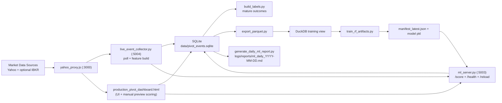

# PivotQuant System

## Purpose
This document is the single operational reference for the live PivotQuant stack:
- data flow
- retrain cadence
- model reload behavior
- daily reporting
- health states and kill-switch guidance

## Architecture

## Core Services
- Dashboard/API proxy: `server/yahoo_proxy.js` on `:3000`
- Event writer: `server/event_writer.py` on `:5002`
- Live collector: `server/live_event_collector.py` on `:5004`
- ML server: `server/ml_server.py` on `:5003`
- Optional IBKR bridge: `server/ibkr_gamma_bridge.py` on `:5001`

## Runtime Entry Points
- Foreground stack: `bash server/run_all.sh`
- Persistent 24/7 stack (with caffeinate): `bash server/run_persistent_stack.sh`
- Retrain cycle: `bash scripts/run_retrain_cycle.sh`
- Retrain LaunchAgent install: `bash scripts/install_retrain_launch_agent.sh`
- Daily report LaunchAgent install: `bash scripts/install_daily_report_launch_agent.sh [close|morning|both]`

## Schedules
- Live collection:
  - Poll interval default: `45s`
  - Source default: `yahoo`
  - Symbols default: `SPY`
- Retrain:
  - LaunchAgent interval default: every `6h` (`StartInterval=21600`)
  - Pipeline: backfill -> labels -> export -> duckdb view -> train -> reload -> daily report
- Daily report:
  - Generated by retrain cycle into `logs/reports/`
  - Delivery:
    - retrain path (optional): `ML_REPORT_NOTIFY_ON_RETRAIN=true`
    - scheduled path: `scripts/install_daily_report_launch_agent.sh`
  - Files:
    - `logs/reports/ml_daily_YYYY-MM-DD.md`
    - `logs/reports/ml_daily_latest.md`

## Data and Model Contracts
- Event identity:
  - Deterministic `event_id` from natural key.
  - DB unique key on `(symbol, ts_event, level_type, level_price, bar_interval_sec)`.
- Prediction logging:
  - `prediction_log` records latest inference outputs and quality flags.
  - `is_preview=0` is treated as live tradeable signal.
- Training target:
  - Matured labels in `event_labels` at horizons `5/15/60`.
- Symbol policy:
  - Retrain default symbol is `SPY` (set by `RETRAIN_SYMBOLS`).

## Retrain Triggers
- Scheduled every 6h by LaunchAgent.
- Manual trigger supported via `bash scripts/run_retrain_cycle.sh`.
- Artifact publish safety:
  - `train_rf_artifacts.py` aborts publish on empty/partial model set unless explicitly overridden.

## Reload Trigger
- Retrain script calls:
  - `POST http://127.0.0.1:5003/reload`
- Reload failure is logged as warning and does not crash the stack.

## Health State Definitions
- `healthy`:
  - Services reachable.
  - Daily report thresholds within expected ranges.
- `degrading`:
  - Elevated calibration drift / low matured sample / stale model warning.
- `kill-switch`:
  - Severe precision degradation across active horizons or excessive model staleness.

Current kill-switch logic is reflected in `scripts/generate_daily_ml_report.py` and emitted in report notes.

## Operational Kill-Switch Guidance
- If report state is `KILL-SWITCH`:
  - stop live execution decisions using ML signals.
  - keep collection on.
  - investigate highest-confidence misses and calibration drift first.
- If state is `DEGRADING`:
  - continue with tighter risk limits.
  - prioritize retrain freshness and data quality checks.

## Observability Surface (Current)
- Service/process health:
  - `scripts/verify_host_ready.sh`
- ML runtime:
  - `GET /health` on `:5003`
- Collector runtime:
  - `GET /health` on `:5004`
- Daily quality report:
  - markdown artifacts under `logs/reports/`
- Report delivery:
  - email / iMessage / webhook from `scripts/send_daily_report.py`
  - scheduler entrypoint: `scripts/run_daily_report_send.sh`
- Persistent history:
  - SQLite table `daily_ml_metrics`

## Key Environment Variables
- Stack:
  - `PIVOT_DB`
  - `HOST`, `PORT`
  - `ML_SERVER_BIND`, `ML_SERVER_PORT`
- Collector:
  - `LIVE_COLLECTOR_ENABLED`
  - `LIVE_COLLECTOR_SYMBOLS`
  - `LIVE_COLLECTOR_SOURCE`
  - `LIVE_COLLECTOR_RANGE`
  - `LIVE_COLLECTOR_POLL_SEC`
  - `LIVE_COLLECTOR_SCORE_ENABLED`
- Retrain:
  - `RETRAIN_SYMBOLS`
- Report notifications:
  - `ML_REPORT_NOTIFY_CHANNELS` (`email,imessage,webhook`)
  - `ML_REPORT_NOTIFY_ON_RETRAIN` (`true|false`)
  - `ML_REPORT_EMAIL_TO`
  - `ML_REPORT_EMAIL_FROM`
  - `ML_REPORT_SMTP_HOST`
  - `ML_REPORT_SMTP_PORT`
  - `ML_REPORT_SMTP_USER`
  - `ML_REPORT_SMTP_PASS`
  - `ML_REPORT_SMTP_USE_TLS`
  - `ML_REPORT_IMESSAGE_TO`
  - `ML_REPORT_WEBHOOK_URL`
  - `ML_REPORT_INCLUDE_LOG_TAILS`
  - `ML_REPORT_LOG_TAIL_LINES`
  - `ML_REPORT_LOG_FILES`
  - `ML_REPORT_ENV_FILE`

## Quick Verification
1. `bash scripts/verify_host_ready.sh`
2. `curl -fsS http://127.0.0.1:5003/health`
3. `curl -fsS http://127.0.0.1:5004/health`
4. `tail -f logs/retrain.log logs/live_collector.log logs/ml_server.log`
